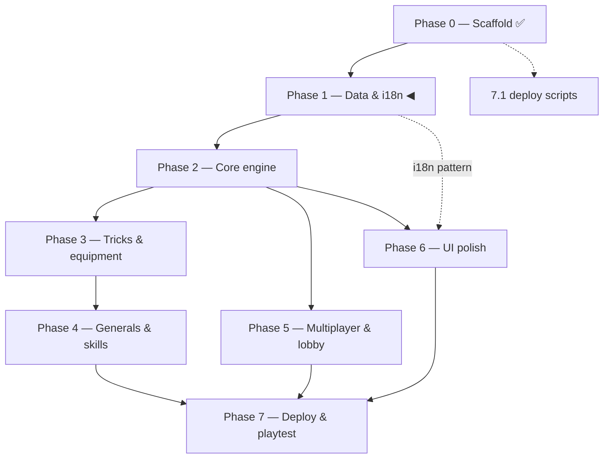
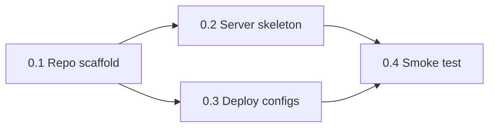
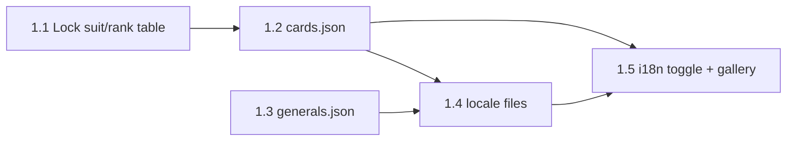
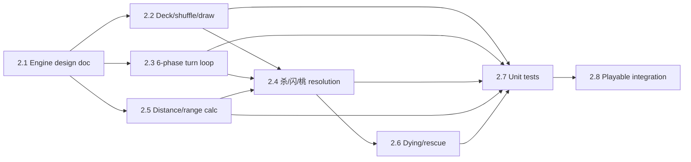
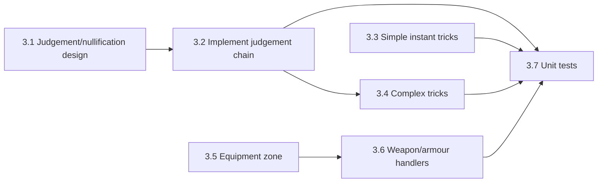
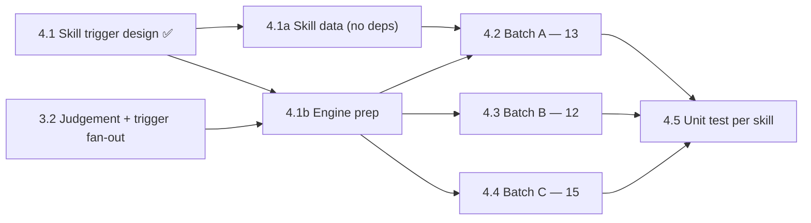
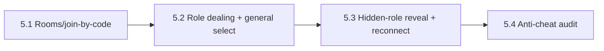
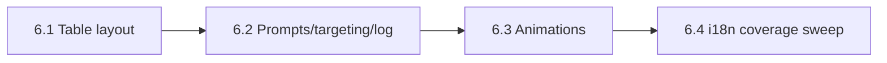
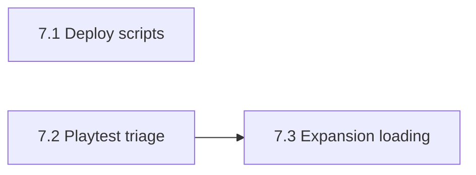

# Build dependency flowchart

Companion to [`build-breakdown.md`](build-breakdown.md). That doc has the task list, model
assignments, and live status; this doc answers "what blocks what" and "what can run at the same
time" — useful when you have more than one session/agent available to work in parallel.

## Phase-level view

After Phase 2 (core engine) is playable, the project splits into **three independent tracks** that
don't touch the same files and can run concurrently: content (Phase 3 → 4), multiplayer (Phase 5),
and UI polish (Phase 6). They all converge at Phase 7 (playtest needs all three done).

**Takeaway:** once Phase 2 ships, you can put three people/sessions on Phase 3+4, Phase 5, and
Phase 6 at the same time without them blocking each other. 7.1 (deploy scripts) has no real
dependencies and can be done any time after 0.1.

---

## Task-level view, by phase

Solid arrow = hard dependency (blocked until done). Dashed arrow = soft dependency (helpful
context, not a hard block).

### Phase 0 — done

0.2 and 0.3 ran in parallel (both only need 0.1).

### Phase 1 — Data & i18n (1.1–1.4 done, 1.5 next)

**1.3 ran parallel to 1.1→1.2** — generals.json only needs plan §3.4, not the card table. 1.4
needed both 1.2 and 1.3 (it keys strings for both cards and generals). 1.5 is next; it needs 1.2 (data
to render) and 1.4 (strings to render it with).

### Phase 2 — Core engine

**2.2, 2.3, and 2.5 can run in parallel** — all three only depend on the 2.1 design doc, and they
touch different pieces of state (deck, phase machine, geometry). 2.4 needs all three because a
Strike resolution touches the deck, the current phase, and range. 2.6 needs 2.4 (can't model dying
without damage resolution existing). 2.7 needs everything it's testing to exist first.

### Phase 3 — Tricks & equipment

**Three independent sub-tracks once Phase 2 is done:** judgement/nullification (3.1→3.2→3.4),
simple tricks (3.3), and equipment (3.5→3.6). None of them share files. 3.4 (complex tricks like
Lightning/Indulgence) needs 3.2 because they resolve through the judgement system.

### Phase 4 — Generals & skills

**The real gate is 4.1b, not 4.1** — [`skill-trigger-design.md`](skill-trigger-design.md) §10.
4.1 (the design) is done; it split implementation into **4.1a** (pure data: `skillIds`, `gender`,
`skills.json`, locale keys — **zero dependencies, a Haiku session can run it right now, in parallel
with everything**) and **4.1b** (engine prep: the `Skill` type, the query fold, `{t:'demand'}`, the
damage window). 4.1b consumes the generic `{t:'trigger'}` fan-out, which **3.1 moved into 3.2** —
so the old "4.1 has a *soft* dependency on the judgement system" is now a **hard** one, one task
later: 4.1b needs 3.2. Once 4.1b lands, 4.2/4.3/4.4 are fully parallel as before. 11 of Batch A's 13
skills have no Phase 3 dependency at all. **苦肉 (Batch B) additionally needs 3.2's F1 fix** — 黄盖
can drop himself to 0 in his own action phase.

### Phase 5 — Multiplayer & lobby

Mostly a straight line — each step needs the room/session state the previous step built. 5.4 (the
`playerView` audit) goes last because it audits what 5.1–5.3 actually expose.

### Phase 6 — Bilingual UI polish

Sequential — each layer builds visually on the last. 6.4 (the audit script) should run last so it's
checking the finished surface, not a half-built one.

### Phase 7 — Deploy & playtest

7.1 has no real dependency on the rest of the project — it can be done any time after 0.1 and is a
good filler task. 7.2 needs Phase 4 + 5 + 6 all done (it's testing the full game).

---

## Practical parallel-work suggestions

- **Right now:** 1.5 is the only open Phase 1 task — single-threaded until it's done, since Phase 2
  needs the full data layer in place.
- **Once Phase 2 ships:** split three ways — content (3→4), multiplayer (5), UI (6). This is the
  biggest parallelization opportunity in the whole project.
- **Within Phase 2:** 2.2/2.3/2.5 are three independent Sonnet sessions if you want to burn down
  Phase 2 faster.
- **Within Phase 3:** judgement (3.1→3.2→3.4), simple tricks (3.3), and equipment (3.5→3.6) are
  three independent sessions.
- **Within Phase 4:** **4.1a (skill data) has no dependencies — hand it to a Haiku session today.** Once 4.1b lands
  (which needs 3.2), the three general batches (4.2/4.3/4.4) are fully parallel.
- **Anytime after 0.1:** 7.1 (deploy scripts) is a zero-dependency task to hand to a spare session.
